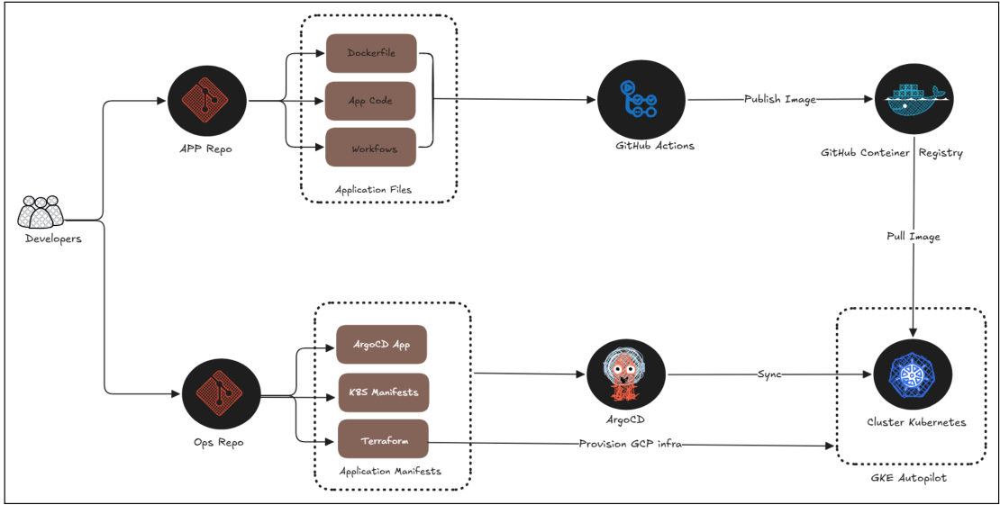

# GitOps: Automação e Gestão de Infraestrutura utilizando Repositórios Git

> Prova de Conceito (PoC) do Trabalho de Conclusão de Curso (TCC)
> **"GitOps: Automação e Gestão de Infraestrutura utilizando Repositórios Git — Uma prova de conceito"**
> Cristopher J. Paiva da Silva — Tecnologias em Análise e Desenvolvimento de Sistemas
> Universidade Tecnológica do Uruguai (UTEC) · Instituto Tecnológico Regional Norte

Este é o **repositório agregador** do TCC. Ele reúne, como *submódulos Git*, os dois
repositórios que compõem a prova de conceito e permite cloná-los e versioná-los em
conjunto, refletindo a arquitetura de **dois repositórios** proposta pela metodologia
GitOps.

---

## Sobre o trabalho

A crescente complexidade da gestão de infraestruturas em nuvem exige soluções robustas
de automação para garantir agilidade e confiabilidade. Este trabalho apresenta uma
**Prova de Conceito de um pipeline de CI/CD fundamentado nos princípios de GitOps**,
demonstrando como o uso de repositórios Git como **única fonte de verdade**
(*single source of truth*), aliado a ferramentas como Docker, Kubernetes, GitHub Actions
e ArgoCD, promove uma infraestrutura **imutável e declarativa**.

**Questão de pesquisa:** como implementar um *pipeline* de CI/CD automatizado, baseado nos
princípios GitOps?

**Objetivo geral:** desenvolver e avaliar uma prova de conceito de um *pipeline* de CI/CD
automatizado, baseado nos princípios de GitOps, e avaliá-lo sob três critérios:
**eficiência**, **consistência** e **rastreabilidade**.

## Arquitetura da solução

A base da estratégia GitOps reside na utilização do Git como *Single Source of Truth*. A
solução foi dividida em **dois repositórios** para garantir separação de responsabilidades
e rastreabilidade ponta a ponta:

| Submódulo | Repositório | Responsabilidade |
|-----------|-------------|------------------|
| [`tcc-app`](https://github.com/cristopherpds/tcc-app) | Aplicação + CI | Código-fonte da aplicação (Python/FastAPI), `Dockerfile` e o *pipeline* de Integração Contínua (GitHub Actions) que constrói e publica a imagem no GHCR. |
| [`tcc-ops`](https://github.com/cristopherpds/tcc-ops) | Operações + CD | Repositório **GitOps**: provisionamento da infraestrutura (Terraform/GKE), manifestos declarativos do Kubernetes e configuração do ArgoCD para a Entrega Contínua. |



> *Figura 1 — Arquitetura geral da solução baseada em GitOps (Fonte: TCC, elaborado pelo autor).*

### Fluxo de ponta a ponta

```
Desenvolvedor cria uma tag de versão (v*) em tcc-app
        │
        ▼
GitHub Actions (CI):  checkout → build da imagem Docker → push no GHCR
        │
        └──► atualiza a tag da imagem em k8s/deployment.yml
             e faz commit na branch deploy/app do repositório tcc-ops
                      │
                      ▼
             ArgoCD detecta a divergência (monitora deploy/app, path k8s)
                      │
                      ▼
             Reconcilia automaticamente o cluster GKE com o estado do Git
             (syncPolicy automated: prune + selfHeal)
```

A cada nova versão da aplicação, a imagem é construída e publicada automaticamente, os
manifestos de implantação são atualizados via Git e o ArgoCD sincroniza o ambiente — **sem
nenhuma intervenção manual no cluster**.

## Tecnologias

| Camada | Ferramenta |
|--------|------------|
| Aplicação de exemplo | Python + **FastAPI** (servida por Uvicorn) |
| Conteinerização | **Docker** |
| Integração Contínua (CI) | **GitHub Actions** |
| Registro de imagens | **GitHub Container Registry (GHCR)** |
| Infraestrutura como Código (IaC) | **Terraform** |
| Orquestração | **Google Kubernetes Engine (GKE Autopilot)** |
| Entrega Contínua (CD) / GitOps | **ArgoCD** |
| Autenticação CI → nuvem | **Workload Identity Federation (OIDC)**, sem chaves de serviço |

## Estrutura deste repositório

```
TCC/
├── tcc-app/        # submódulo → aplicação + pipeline de CI
├── tcc-ops/        # submódulo → infraestrutura (Terraform), K8s e ArgoCD
└── docs/img/       # imagens utilizadas na documentação
```

Cada submódulo possui o seu próprio `README.md` com instruções detalhadas:

- **[`tcc-app/README.md`](tcc-app/README.md)** — endpoints da API, como rodar localmente
  (Python ou Docker) e detalhes do *pipeline* de CI / geração de *releases*.
- **[`tcc-ops/README.md`](tcc-ops/README.md)** — provisionamento da infraestrutura com
  Terraform, *bootstrap* do ArgoCD e descrição dos manifestos Kubernetes.

## Como clonar

Por conter submódulos, clone com a flag `--recurse-submodules`:

```bash
git clone --recurse-submodules https://github.com/cristopherpds/TCC.git
```

Se já clonou sem a flag, inicialize os submódulos:

```bash
git submodule update --init --recursive
```

Para atualizar os submódulos para as últimas versões registradas:

```bash
git submodule update --remote
```

## Resultados

Durante o estudo de caso foram desenvolvidas e implantadas **cinco funcionalidades**
independentes na aplicação. Cada alteração gerou uma nova versão da imagem Docker e
desencadeou automaticamente todo o fluxo de CI/CD. Os tempos observados:

| Funcionalidade | Build (s) | Deploy (s) | Total (s) |
|----------------|:---------:|:----------:|:---------:|
| Random User | 31 | 2 | 33 |
| Nationality Users | 29 | 1 | 30 |
| Age Prediction | 27 | 1 | 28 |
| Pokémon | 98 | 2 | 100 |
| Bitcoin | 36 | 1 | 37 |

> *Tabela 1 — Tempos observados durante o processo de CI/CD (Fonte: TCC).*

A avaliação confirmou os três critérios propostos:

- **Eficiência** — novas versões disponibilizadas em poucos minutos, com o tempo de
  implantação propriamente dito (ArgoCD + Kubernetes) entre 1 e 2 segundos; a maior parte
  do tempo concentra-se no *build* da imagem.
- **Consistência** — nenhuma divergência entre o estado declarado no Git e o estado
  executado no cluster (mitigação de *Configuration Drift* pela reconciliação contínua).
- **Rastreabilidade** — toda alteração é auditável do *commit* de origem até a implantação
  em produção, por meio do histórico de *commits*, das execuções do GitHub Actions e das
  sincronizações registradas pelo ArgoCD.

## Trabalhos futuros

Ampliação da PoC para cenários multinuvem e multi-cluster, incorporação de práticas de
**DevSecOps** (verificações de segurança automatizadas no *pipeline*) e integração de
ferramentas de observabilidade e monitoramento.

## Autoria

- **Cristopher J. Paiva da Silva** — autor · UTEC / Instituto Tecnológico Regional Norte
- **Vinícius Bittencourt da Silva** — orientador · IFSul, Campus Sant'Ana do Livramento
- **Rafael Machado Amorim** — coorientador · Unipampa, Campus Sant'Ana do Livramento
